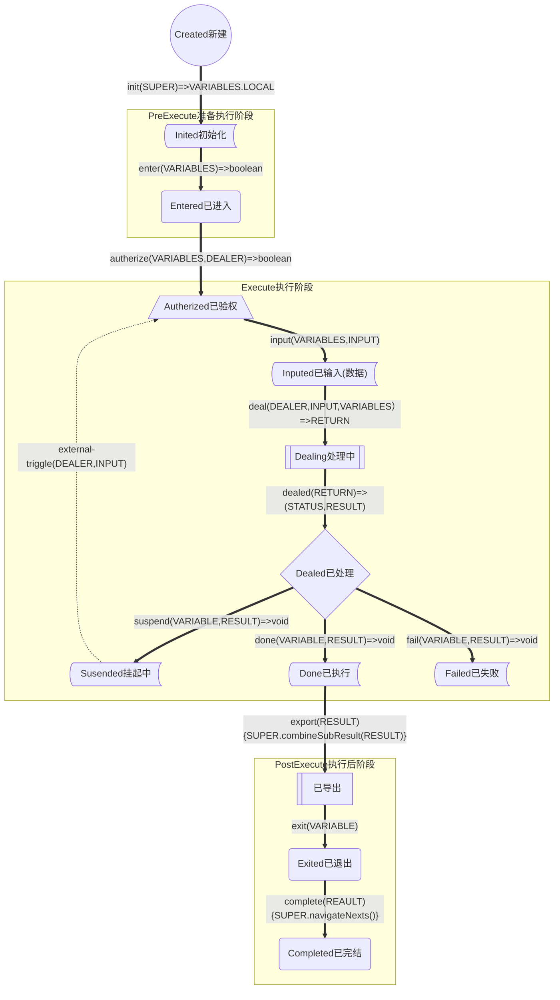

Execute Status
-----------------

```mermaid
graph TD
Created@{
    label : "Created新建"
    shape: circle
    curve: linear
}
subgraph  PreExecute准备执行阶段
    Inited@{
        label : "Inited初始化"
        shape: bow-rect
        curve: linear
    }
    Entered@{
        label : "Entered已进入"
        shape: rounded
        curve: linear
    }
    
    Inited      =="enter(VARIABLES)=>boolean"==>   Entered
end
Created     =="init(SUPER)=>VARIABLES.LOCAL"==>   Inited


subgraph  Execute执行阶段
    Autherized@{
        label : "Autherized已验权"
        shape: trap-b
        curve: linear
    }

    Inputed@{
        label : "Inputed已输入(数据)"
        shape: bow-rect
        curve: linear
    }

    Dealing@{
        label : "Dealing处理中"
        shape: subproc
        curve: linear
    }

    Dealed@{
        label: "Dealed已处理"
        shape: diamond
        curve: linear
    }

    Suspended@{
        label : "Susended挂起中"
        shape: bow-rect
        curve: linear
    }

    Done@{
        label : "Done已执行"
        shape: bow-rect
        curve: linear
    }

    Failed@{
        label : "Failed已失败"
        shape: bow-rect
        curve: linear
    }

    
    Autherized      =="input(VARIABLES,INPUT)"==>       Inputed
    Inputed         =="deal(DEALER,INPUT,VARIABLES）=>RETURN"==>       Dealing
    Dealing         =="dealed(RETURN)=>(STATUS,RESULT)"==>       Dealed
    Dealed          =="suspend(VARIABLE,RESULT)=>void"==>       Suspended
    Dealed          =="fail(VARIABLE,RESULT)=>void"==>       Failed
    Dealed          =="done(VARIABLE,RESULT)=>void"==>       Done

end

Entered =="autherize(VARIABLES,DEALER)=>boolean"==> Autherized

Suspended -.external-triggle(DEALER,INPUT).-> Autherized

subgraph  PostExecute执行后阶段
    

    Exported@{ 
        shape: lin-rect
        label: "已导出" 
    }

    Exited@{
        label : "Exited已退出"
        shape: rounded
    }

    Completed@{
        label : "Completed已完结"
        shape: rounded
    }
    Exported    =="exit(VARIABLE)"==>       Exited
    Exited      =="complete(REAULT){SUPER.navigateNexts()}"==> Completed
end

Done    =="export(RESULT){SUPER.combineSubResult(RESULT)}"==> Exported

```
