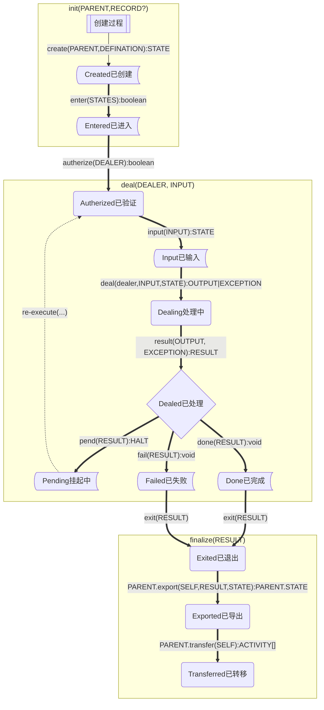

### Actvity Status Transfer

```mermaid
graph TD

subgraph "init(PARENT,RECORD?)"
    Creation[[创建过程]]
    --create(PARENT,DEFINATION):STATE-->
    Created@{
        label : "Created已创建"
        shape: bow-rect
        curve: linear
    }
    ==enter(STATES):boolean==>
    Entered@{
        label : "Entered已进入"
        shape: bow-rect
        curve: linear
    }
end
subgraph "deal(DEALER, INPUT)"
    Entered==autherize(DEALER):boolean==>
    Autherized@{
        label: "Autherized已验证"
        shape: rounded
        curve: linear
    }
    ==input(INPUT):STATE==>
    Input@{
        label: "Input已输入"
        shape: bow-rect
        curve: linear
    }
    ==deal(dealer,INPUT,STATE):OUTPUT|EXCEPTION==>
    Dealing@{
        label: "Dealing处理中"
        shape: rounded
        curve: linear
    }
    ==result(OUTPUT, EXCEPTION):RESULT==>
    Dealed@{
        label: "Dealed已处理"
        shape: diamond
        curve: linear
    }
    ==pend(RESULT):HALT==>
    Pending@{
        label: "Pending挂起中"
        shape: bow-rect
        curve: linear
    }
    Pending -."re-execute(...)".->Autherized
    Dealed ==fail(RESULT):void==>
    Failed@{
        label: "Failed已失败"
        shape: bow-rect
        curve: linear
    }
    Dealed ==done(RESULT):void==>
    Done@{
        label: "Done已完成"
        shape: bow-rect
        curve: linear
    }
end

subgraph "finalize(RESULT)"
    Done ==exit(RESULT)==> Exited
    Failed ==exit(RESULT)==> Exited
    Exited@{
        label: "Exited已退出"
        shape: rounded
        curve: linear
    }
    ==PARENT.export(SELF,RESULT,STATE):PARENT.STATE==>
    Exported@{
        label: "Exported已导出"
        shape: rounded
        curve: linear
    }
    ==PARENT.transfer(SELF):ACTIVITY[]==>
    Transferred@{
        label: "Transferred已转移"
        shape: rounded
        curve: linear
    }
    
end
```
